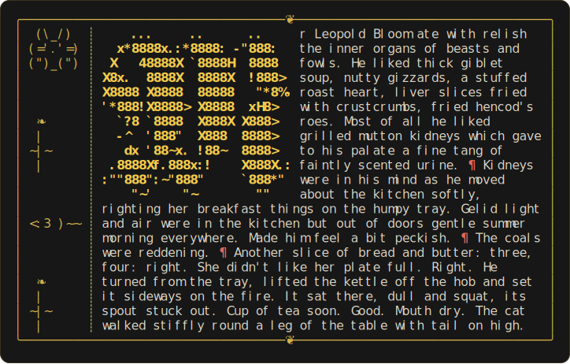

# lindisfarner

[](https://github.com/norwytch/lindisfarner/actions/workflows/ci.yml)
[](LICENSE)

Rust CLI tool that illuminates text files with ASCII art. 

<p align="center">
  
</p>

## Features

| Manuscript element | Lindisfarner adaptation |
|---|---|
| Illuminated initial / versal | A large FIGlet drop-cap; the opening lines flow down its side |
| Rubrication (red ink for key words) | `--rubricate word,word` highlights matching words |
| Gold leaf / chrysography | The initial, painted in the theme's accent colour |
| Decorative border & marginalia | `--border` styles, with an ❦ flourish on the ornate frame |
| Drolleries (marginal doodles) | `--drolleries` scatters small ASCII figures down the margin |
| Two-column codex | `--columns 2` sets the body in side-by-side columns |
| The page itself | A wrapped, framed text block at a chosen `--width` |

## Install

```sh
cargo install lindisfarner
```

Or build from source:

```sh
cargo build --release
./target/release/lindisfarner sample.txt
```

Reads a file or standard input; writes to stdout or `--output`.

## Options

```
lindisfarner [OPTIONS] [FILE]

  -w, --width <N>        Body text width             [default: terminal width]
  -b, --border <STYLE>   none | simple | double | ornate   [default: ornate]
  -t, --theme <THEME>    gold | crimson | mono       [default: gold]
  -c, --color <WHEN>     auto | always | never       [default: auto]
  -d, --drop-cap <WHICH> first | all | none          [default: first]
  -f, --font <FONT>      blackletter | standard      [default: blackletter]
  -r, --rubricate <W,..> words to highlight in the rubric colour
  -j, --justify          set the body flush to both margins
      --hyphenate        break over-long words with a trailing hyphen
      --incipit          rubricate the opening line
      --fillers          fill short closing lines with ❧ ornaments
      --columns <N>      set the text in N columns, codex-style   [default: 1]
      --drolleries       adorn the left margin with ASCII marginal figures
      --seed <N>         vary which drolleries appear   [default: 0]
  -p, --pilcrows         run paragraphs together, separated by an inline ¶
  -o, --output <FILE>    write to a file instead of stdout
      --completions <SHELL>  print a shell completion script and exit
      --man              print a roff man page and exit
```

Colour is automatic: it turns on for a terminal and off when piped or written
to a file, so saved pages stay clean plain text. With no `--width`, the page
fills the terminal (and falls back to 60 columns when output is piped).

## Notes & limitations

- **Line endings** are normalised, so `\r\n` (Windows) and `\r` (classic Mac)
  files split into paragraphs the same way as Unix text.
- **Minimum width.** `--width` is clamped to a floor of 24 columns so the page
  stays readable.
- **Pilcrows vs. columns vs. drolleries** compose: pilcrows flow the text into
  one block, `--columns` sets that block in a codex, and drolleries scatter down
  the outer margin independent of the paragraph count.

## Examples

```sh
# Every paragraph gets its own initial, in a double frame
lindisfarner sample.txt --drop-cap all --border double

# Crimson theme, rubricate a few words, force colour through a pipe
lindisfarner sample.txt -t crimson -r gold,vellum,scriptorium -c always | less -R

# A justified two-column codex page with a rubricated incipit
lindisfarner sample.txt --columns 2 --justify --incipit -w 90

# Run paragraphs together with red/blue alternating pilcrows
lindisfarner sample.txt --pilcrows -c always | less -R

# Drolleries in the margin, reshuffled with a seed
lindisfarner sample.txt --drolleries --seed 3

# Save a plain (no-colour) illuminated page
lindisfarner sample.txt -o page.txt
```

## Shell completions & man page

```sh
lindisfarner --completions bash > /usr/local/etc/bash_completion.d/lindisfarner
lindisfarner --man > /usr/local/share/man/man1/lindisfarner.1
```

Completions are available for bash, zsh, fish, PowerShell, and elvish.

## How it fits together

- `src/lib.rs` — the public API: `Config` and `render`.
- `src/illuminate.rs` — word-wrapping, justification, and the drop-cap
  composition (the core).
- `src/border.rs` — the frame and its flourishes.
- `src/style.rs` — the colour palette / themes.
- `src/drollery.rs` — the marginal menagerie.
- `src/main.rs` — the CLI: argument parsing and input/output.

## Use as a library

The crate is also a library. Build a `Config` and call `render`:

```rust
use lindisfarner::{render, Config, Theme};

let cfg = Config {
    theme: Theme::Crimson,
    colored: true,
    justify: true,
    ..Config::default()
};
let page = render("Within the quiet scriptorium…", &cfg);
print!("{page}");
```

## Typeface

The illuminated initials default to a Fraktur capital letter, which imitates the traditional blackletter book hand used in English monasteries. The font is embedded in the binary (`fonts/fraktur.flf`), so nothing extra is needed at runtime. Use
`--font standard` for plain FIGlet block capitals instead. We encourage users to add their own fonts to experiment with different traditions of illumination. 

Credits: the blackletter glyphs come from the FIGlet font *Fraktur.flf* by
Philip Menke (1995), part of the freely distributable FIGlet font collection.
The default block font is the standard FIGlet font (Glenn Chappell & Ian Chai).

## Drolleries

With `--drolleries`, small ASCII figures are scattered down the left margin,
separated from the text by a ruled line. They are placed at fixed intervals
independent of the paragraph structure, so the margin fills with figures whether
the text is one flowing block or many paragraphs. These imitate the original
drolleries found in the margins of illuminated manuscripts, which most often
depicted human-animal hybrid figures that reflected the wild imagination of the
medieval monastic. The figures come from a fixed built-in repertoire
(`src/drollery.rs`): a hare, cat, owl, fish, mouse, snail, bird, and a vine
flourish. Selection is deterministic, so a given file always renders the same;
pass `--seed N` to reshuffle the figures. We encourage users to add their own
drolleries by simply adding to `drollery.rs`.

## Ideas to extend

- **Right / outer margin**: a `--margin left|right` switch (the merge already
  supports either side — just swap the column order).
- **Glosses & manicules**: a second margin channel for user notes or a `☞` set
  beside lines containing rubricated words.
- **Codebase analysis**: given a codebase, use lindisfarner for some light vandalism. 

  ## Acknowledgements
  This tool is a late wedding present for my dear friend Neil Douglas Reilly. 